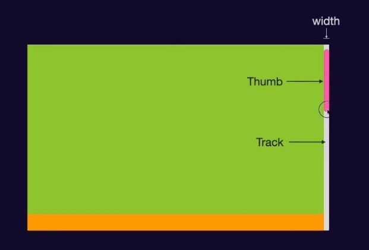

## CSS

了解一些零碎的前端知识

### 自定义滚动条



```css

::-webkit-scrollbar{
  width: 10px;
}
::-webkit-scrollbar-track{
  background-color: var(--vp-c-bg);
}
::-webkit-scrollbar-thumb{
  background-color:var(--vp-c-indigo-1);
  border-radius: 10px;
}
::-webkit-scrollbar-thumb:hover{
  background-color: var(--vp-c-purple-3);
}

```

### 判断文本框文字

纯CSS无法判断文本框内是否有文字，但是可以通过`input`元素的有一个`required`属性

```css
.from input:valid ~ label{}	
```

上述代码表示，文本框只有验证通过才能选中，只有有文字才能验证通过

## JavaScript

### 原型链

所有的对象都是 `New` 出来的

```js
function A(){}
const a = new A();
```

```js
const obj = {}
```

上述写法，背后其实也 `new` 了一个 `object`

通过一个函数 `new`，可以产生一个对象

每一个函数它是一个双胞胎，产生函数的时候它就会产生一个函数的 **原型**

```js
function A(){}
A.prototype	// 自带一个属性叫做prototype
```

它是一个对象，我们叫做原型对象

通过函数 `new` 出来的对象，也有个属性叫做 `__proto__`，隐式原型

`__proto__` 隐式原型和 `prototype` 原型是完全一样的

```js
a.__proto__ === A.prototype	// true
```

::: info

`__proto__` 现在这个属性官方已经不建议使用了

:::

`prototype` 是一个 **普通对象**，通过 `Object` 函数 `new` 出来的

```js
new Object()
```

而每一个函数都有个原型，所以 **Object** 的原型是 `prototype`

它的 **隐式原型** 就等于 `new` 出它的函数的 **原型**

**Object** 的原型的隐式原型是 `null`

函数是一个可以被调用的 **对象**，任何对象都是被 `new` 出来的

函数则是 `new` 一个 **Function** 函数产生的

